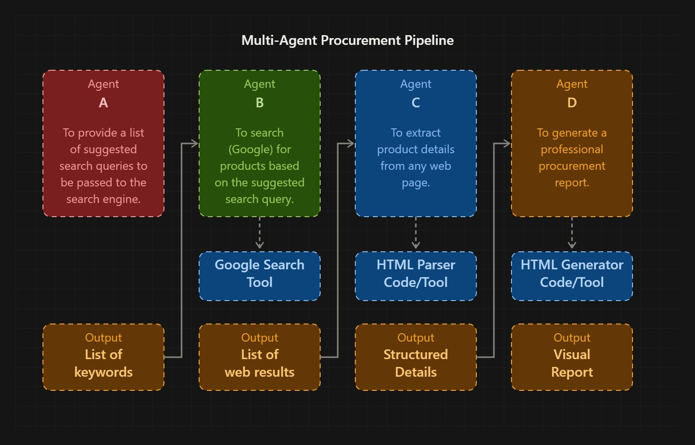

# Rankyx Procurement Agent

An AI-powered procurement assistant built with **LangGraph**, **Groq**, **Tavily**, and **ScrapeGraphAI**. Given a product name and a list of target e-commerce sites, the agent autonomously searches, scrapes, extracts structured product data, and generates a professional HTML procurement report.

> Built as a demonstration of multi-step agentic workflows with LLM tool orchestration and structured output extraction.

---

## 🧭 Agent Flow

<p align="center">
  
</p>

The graph runs four sequential nodes:

1. **Suggest Queries** — The LLM generates up to *N* targeted search queries (brands, models, technologies) that resolve to single-product pages.
2. **Search** — Tavily executes each query; results are filtered by relevance score, deduplicated by URL, and sorted.
3. **Scrape & Extract** — ScrapeGraphAI visits the top results and extracts structured product data (title, price, specs, etc.) validated against a Pydantic schema.
4. **Report** — The LLM composes a polished HTML procurement report with findings, analysis, and ranked recommendations.

---

## ✨ Features

- **Fully autonomous pipeline** — one call runs the entire flow from queries to final report.
- **Structured extraction** — product data is validated with Pydantic models (`ExtractedProduct`, `ProductSpec`).
- **Configurable inputs** — product, target sites, country, language, query count, relevance threshold, and top-N recommendations.
- **Intermediate artifacts** — every stage writes a JSON file to `./ai-agent-output` for debugging and reproducibility.
- **Styled HTML report** — Bootstrap-based output ready to open in any browser.

---

## 📁 Project Structure

```
.
├── ai_agent.ipynb              # Main agent
├── .env.example                # Environment variable template
├── assets/
│   └── agent-flow.jpg          # Flow diagram
└── ai-agent-output/            # Generated on first run
    ├── step_1_suggested_search_queries.json
    ├── step_2_search_results.json
    ├── step_3_search_results.json
    └── step_4_procurement_report.html
```

---

## 🚀 Getting Started

### 1. Clone the repository

```bash
git clone https://github.com/AbdelkaderHamdi/rankyx-agent.git
cd rankyx-agent
```

### 2. Install dependencies

```bash
pip install -U \
  langchain-groq \
  langgraph \
  tavily-python \
  scrapegraph-py \
  pydantic \
  python-dotenv
```


### 3. Configure environment variables

Copy the template and fill in your keys:

```bash
cp .env.example .env
```

```dotenv
GROQ_API_KEY=your_groq_api_key_here
TAVILY_API_KEY=your_tavily_api_key_here
SGAI_API_KEY=your_scrapegraph_api_key_here
```

| Variable | Where to get it |
|---|---|
| `GROQ_API_KEY` | https://console.groq.com/keys |
| `TAVILY_API_KEY` | https://app.tavily.com/home |
| `SGAI_API_KEY` | https://dashboard.scrapegraphai.com/ |

### 4. Run the agent

Output is written to `./ai-agent-output/`. Open `step_4_procurement_report.html` in a browser to view the report.

---

## ⚙️ Configuration

Edit the `inputs` block at the bottom of `ai_agent.ipynb`:

```python
app.invoke({
    "inputs": {
        "product_name": "coffee machine for the office",
        "websites_list": ["www.amazon.eg", "www.jumia.com.eg", "www.noon.com/egypt-en"],
        "country_name": "Egypt",
        "no_keywords": 10,
        "language": "English",
        "score_th": 0.10,
        "top_recommendations_no": 10,
    }
})
```

| Field | Description |
|---|---|
| `product_name` | What you want to buy. |
| `websites_list` | Target e-commerce domains. |
| `country_name` | Market / region context. |
| `no_keywords` | Max number of search queries to generate. |
| `language` | Language of the generated queries. |
| `score_th` | Minimum Tavily relevance score to keep a result (0–1). |
| `top_recommendations_no` | How many pages to scrape and include. |

---

## 📦 Tech Stack

| Layer | Tool |
|---|---|
| Agent orchestration | [LangGraph](https://github.com/langchain-ai/langgraph) |
| LLM | [Groq](https://groq.com/) — `qwen/qwen3.8-27b` |
| Web search | [Tavily](https://tavily.com/) |
| Web scraping | [ScrapeGraphAI](https://scrapegraphai.com/) |
| Schema validation | [Pydantic](https://docs.pydantic.dev/) |

---

## 📝 Output Artifacts

| File | Description |
|---|---|
| `step_1_suggested_search_queries.json` | Queries generated by the LLM. |
| `step_2_search_results.json` | Deduplicated, scored search results. |
| `step_3_search_results.json` | Structured product data extracted from pages. |
| `step_4_procurement_report.html` | Final Bootstrap-styled procurement report. |

---

## 📄 License

MIT — see [`LICENSE`](LICENSE) for details.